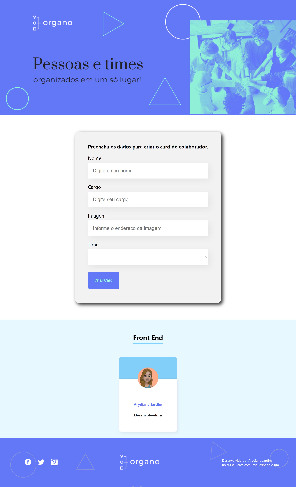

# Projeto Organo
Projeto Organo é uma aplicação que vai gerir os colaboradores da Alura, separados das escolas desenvolvido durante o curso de React com JavasScript da Alura. 

<strong>Objetivos:</strong> 

- Implementar componentes reativos 
- Manipulação de formulário
- Cadastrar colaboradores

## 💻 Layout  

### Web

  

 ## 🔧 Tecnologias 

As tecnologias usadas foram: 
* HTML
* CSS
* JavaScript
* React
